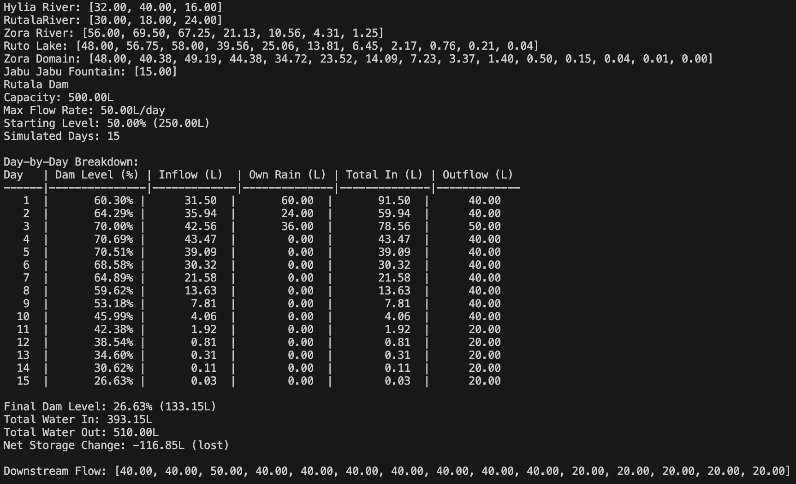

# River Flow Language Interpreter

A **Java-based interpreter for a domain-specific language (DSL)**
designed to model river systems, lakes, and dams with realistic water
flow behaviour over time.

The language allows users to describe water networks using simple syntax
and simulate how water propagates through the system across multiple
days.

## Features

-   River and lake modelling using rainfall-driven flow
-   Multi-day water propagation using a decay model
-   Flow networks connecting multiple water systems
-   Policy-based dam management algorithms
-   Full interpreter pipeline (scanner → parser → AST → interpreter)

------------------------------------------------------------------------

# River and Lake Modelling

Water systems are defined using a flow multiplier and rainfall values.

    var ZoraRiver = @'Zora River' 5L[5];

Flow is calculated as:

    flow = multiplier × rainfall

Example output:

    Zora River: [25.00]

------------------------------------------------------------------------

# Flow Networks

Water systems can be connected using the `~` operator.

    ZoraRiver ~ RutoLake;

This models upstream water flowing into downstream systems.

------------------------------------------------------------------------

# Multi-Day Water Propagation

Water moves through the network over time using a **decay model**.

    Day 0: 50%
    Day 1: 25%
    Day 2: 12.5%
    Day 3: 6.25%
    Day 4: 3.125%

Example program:

    var ZoraRiver = @'Zora River' 5L[5, 8, 3];
    var RutoLake = @'Ruto Lake' 4L[5, 6, 2, 7];

    ZoraRiver ~ RutoLake;

    print ZoraRiver;
    print RutoLake;

Example output:

    Zora River: [25.00, 40.00, 15.00]
    Ruto Lake: [32.50, 50.25, 28.63, 38.31, ...]

------------------------------------------------------------------------

# Dam Simulation

The language includes support for **programmable dams** that control
water release based on reservoir level.

Example:

    dam RutalaDam | 'Rutala Dam'
        capacity 300L
        maxflow 50L
        start 0.5
        rainfall 12L[5, 2]
        simulate 10
        policy {
            threshold 0.8 release 1.0;
            threshold 0.5 release 0.8;
            threshold 0.1 release 0.4;
            default release 0;
        }
    | RutoLake, JabuJabuFountain;

    print RutalaDam;

The dam release algorithm adjusts output dynamically depending on:

-   upstream inflow
-   rainfall
-   current reservoir level

Example output:

    Day | Dam Level (%) | Inflow | Rain | Total In | Outflow
    1   | 62%           | 16.0   | 60.0 | 76.0     | 40.0
    2   | 60.6%         | 12.0   | 24.0 | 36.0     | 40.0
    ...

------------------------------------------------------------------------

# Language Syntax

## Rivers and Lakes

    var <name> = @'<display_name>' <multiplier>L[<rainfall_values>];

Example:

    var ZoraRiver = @'Zora River' 5L[5,8,3];

------------------------------------------------------------------------

## Flow Connections

    <upstream> ~ <downstream>;

------------------------------------------------------------------------

## Dam Definition

    dam <name> | '<display_name>' parameters policy { rules } | inflow_sources;

Parameters include:

    capacity <value>L
    maxflow <value>L
    start <0.0–1.0>
    rainfall <multiplier>L[values]
    simulate <days>

------------------------------------------------------------------------

## Policy Rules

    policy {
        threshold 0.8 release 1.0;
        threshold 0.5 release 0.8;
        threshold 0.1 release 0.4;
        default release 0;
    }

Thresholds determine how much water is released depending on dam fill
level.

------------------------------------------------------------------------

# Interpreter Architecture

The interpreter is implemented in **Java** and includes the full
language pipeline:

-   lexical scanner
-   recursive descent parser
-   abstract syntax tree (AST)
-   interpreter execution engine

------------------------------------------------------------------------

# Running the Interpreter

Compile and run from the project root:

    ./compile.sh
    ./run.sh

Example demo programs are located in:

    Demo Programs/

Example input / output of a program:

    var HyliaRiver = @'Hylia River' 8L[4, 5, 2];
    var RutalaRiver = @'RutalaRiver' 6L[5, 3, 4];
    var ZoraRiver = @'Zora River' 5L[5, 5, 5];
    var RutoLake = @'Ruto Lake' 4L[5, 2];
    var ZoraDomain = @'Zora Domain' 12L[2];
    var JabuJabuFountain = @'Jabu Jabu Fountain' 5L[3];

    HyliaRiver ~ ZoraRiver;  
    RutalaRiver ~ ZoraRiver;
    ZoraRiver ~ RutoLake ~ ZoraDomain;

    print HyliaRiver;
    print RutalaRiver;
    print ZoraRiver;
    print RutoLake;
    print ZoraDomain;
    print JabuJabuFountain;

    dam RutalaDam | 'Rutala Dam' capacity 500L maxflow 50L start 0.5 rainfall 12L[5, 2, 3] simulate 15 policy {
        threshold 0.8 release 1.0; // release full flow if over 0.8
        threshold 0.5 release 0.8; // release 0.8 flow over 50% capacity
        threshold 0.1 release 0.4; // release 0.4 flow if over 10% capacity
        default release 0; // release nothing if under 10% capacity
    } | ZoraDomain, JabuJabuFountain;

    print RutalaDam;

------------------------------------------------------------------------

# Design Goals

The language was designed to be:

-   **readable** -- syntax resembles natural descriptions of water flow
-   **expressive** -- complex water systems can be described concisely
-   **realistic** -- includes decay-based water propagation and dam
    control policies

Notable design choices include:

-   `~` operator representing water flow
-   rainfall arrays representing multi-day precipitation
-   threshold-based dam policies modelling real-world reservoir
    management

------------------------------------------------------------------------

# Technologies

-   Java
-   Recursive Descent Parsing
-   AST Interpreter Architecture

------------------------------------------------------------------------

# Future Improvements

Possible extensions include:

-   visualization of water networks
-   configurable decay models
-   stochastic rainfall simulation
-   graphical simulation interface
